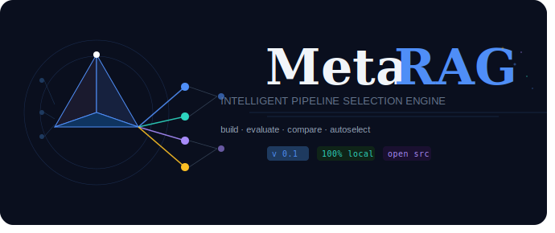

<div align="center">



<br/>

[](https://python.org)
[](https://pypi.org/project/metarag-sdk/)
[](https://ollama.com)
[](LICENSE)
[]()

<br/>

> **MetaRAG** is an open-source engine that takes the guesswork out of RAG pipeline design.
> Instead of manually tuning chunking strategies, retrieval backends, and rerankers —
> MetaRAG benchmarks them all and routes every query to the configuration
> that actually performs best on your data.
>
> *Think of it as AutoML, but for RAG.*

<br/>

---

</div>

## 📌 Table of Contents

- [Why MetaRAG](#-why-metarag)
- [Architecture](#-architecture)
- [Components](#-components)
- [Quickstart](#-quickstart)
- [Pipeline Selection](#-pipeline-selection)
- [Evaluation](#-evaluation)
- [Supported Models](#-supported-models)
- [Roadmap](#-roadmap)
- [Future Scope](#-future-scope)
- [Project Structure](#-project-structure)
- [Contributing](#-contributing)

---

## 🤔 Why MetaRAG

Every team building a RAG system faces the same unsolved problem:

```
Which chunking strategy should I use?
Which retrieval method works best for my documents?
How do I know if my pipeline is actually good?
What happens when a different query type breaks everything?
```

Current tools make you answer these questions manually — every time, for every project.

| Tool | Build RAG | Evaluate | Compare | Auto-Select | Learn |
|------|-----------|----------|---------|-------------|-------|
| LangChain | ✅ | ❌ | ❌ | ❌ | ❌ |
| LlamaIndex | ✅ | ❌ | ❌ | ❌ | ❌ |
| RAGAS | ❌ | ✅ | ❌ | ❌ | ❌ |
| **MetaRAG** | ✅ | ✅ | ✅ | ✅ | ✅ |

MetaRAG owns the **entire RAG workflow** — from raw documents to evaluated, auto-selected, continuously improving answers. No LangChain dependency in the core — the retrieval and chunking logic is hand-built on top of `numpy`, `pandas`, and `rank-bm25` only.

---

## 🏗 Architecture

```
                        ┌─────────────────────────────────────────┐
                        │              USER INTERFACE              │
                        │   MetaRAG(docs, embeddings, generator)   │
                        │            .fit()  .ask()                │
                        └─────────────────┬─────────────────────────┘
                                          │
                 ┌────────────────────────▼────────────────────────┐
                 │                    METARAG CORE                  │
                 │                                                  │
                 │   ┌──────────┐    ┌──────────┐   ┌───────────┐   │
    Documents ──►│   │  Loader  │───►│ Chunker  │──►│ Embeddings│   │
                 │   └──────────┘    └──────────┘   └─────┬─────┘   │
                 │                                        │         │
                 │                              ┌─────────▼──────┐  │
                 │                              │  Vector Database│ │
                 │                              │ InMemory│Chroma │ │
                 │                              │      │ FAISS   │ │
                 │                              └─────────┬──────┘  │
                 │                                        │         │
                 │                              ┌─────────▼──────┐  │
                 │                              │   Retrievers   │  │
                 │                              │ BM25 │ Dense   │  │
                 │                              │ Hybrid │ MMR   │  │
                 │                              └─────────┬──────┘  │
                 │                                        │         │
    Query ──────►│   ┌──────────┐               ┌────────▼──────┐  │
                 │   │  Router  │──────────────► │   Pipelines  │   │
                 │   │ (cold-   │               │Straight│MQuery│   │
                 │   │  start → │               │Reranked│Full  │   │
                 │   │  learned)│               └────────┬──────┘   │
                 │   └────▲─────┘                        │          │
                 │        │                     ┌────────▼──────┐   │
                 │        │                     │   Evaluator   │   │
                 │        │                     │  (5 metrics)  │   │
                 │        │                     └────────┬──────┘   │
                 │        │                              │          │
                 │        └────────── benchmark() ───────┘          │
                 │              trains router from win-rates        │
                 └───────────────────────────────────────┬──────────┘
                                                          │
                                                    ┌─────▼──────┐
                                                    │   Answer   │
                                                    │text│score  │
                                                    │pipeline│ms │
                                                    └────────────┘
```

---

## 🧩 Components

### 📂 Document Loader
Loads any supported document type automatically — no configuration needed. Optional-dependency formats are skipped gracefully with one summary line, not a crash.

```python
from metarag import DocumentLoader

loader = DocumentLoader("./data")                # folder (recursive)
loader = DocumentLoader("./data/contract.pdf")   # single file
docs   = loader.load()
```

| Format | Support |
|--------|---------|
| PDF | ✅ (`pip install metarag-sdk[pdf]`) |
| TXT | ✅ |
| DOCX | ✅ (`pip install metarag-sdk[docx]`) |
| HTML | ✅ (`pip install metarag-sdk[html]`) |
| CSV | ✅ |
| JSON | ✅ |
| Markdown | ✅ |
| Nested directories | ✅ |

---

### ✂️ Chunker
Six strategies. One interface. All zero-dependency and free — no embedding or LLM calls in any of them.

```python
from metarag import Chunker

chunker = Chunker(strategy="recursive")      # sensible default
chunks  = chunker.chunk_documents(docs, cache_dir=".metarag/cache/chunks")
```

| Strategy | Best For |
|----------|----------|
| `fixed` | Quick baseline |
| `recursive` | General purpose ⭐ |
| `sentence` | Conversational text |
| `semantic` | Loosely topic-grouped text |
| `sliding_window` | Overlap-heavy retrieval |
| `markdown` | Structured docs — splits on headers, keeps them in metadata |

---

### 🗄 Vector Database
In-memory by default (zero dependencies). Chroma and FAISS as drop-in swaps.

```python
from metarag import InMemoryVectorDB, ChromaVectorDB, FAISSVectorDB

db = InMemoryVectorDB()                              # zero-dep default
db = ChromaVectorDB(persist_directory=".metarag/index")
db = FAISSVectorDB()

db.build(chunks, embeddings)   # embeddings computed beforehand, once
db.search(query_embedding, k=4)
db.add(new_chunks, new_embeddings)
```

---

### 🔍 Retrievers
Four retrieval strategies, all returning `(chunk, score)` pairs directly — no separate "with score" call needed.

```python
from metarag import BM25Retriever, DenseRetriever, HybridRetriever, MMRRetriever

bm25   = BM25Retriever(chunks)                              # keyword
dense  = DenseRetriever(chunks, embeddings, vector_db)       # semantic
hybrid = HybridRetriever(chunks, embeddings, vector_db, alpha=0.5)  # combined
mmr    = MMRRetriever(chunks, embeddings, vector_db)          # diverse

results = hybrid.retrieve("your query", k=4)   # [(chunk, score), ...]
```

MMR is hand-implemented — vectorized relevance scoring plus greedy diversity selection, no `sklearn` dependency.

---

### ⚙️ Pipelines
`fit()` assembles pipelines automatically from your configured retrievers — you don't wire these by hand for the default flow.

```python
from metarag import MetaRAG

rag = MetaRAG(docs="./data", embeddings=embeddings, generator=generator)
rag.fit()

rag.pipeline_graph()   # prints the actual stage graph for every built pipeline
```

| Pipeline | What it does |
|----------|----------------|
| `straight` | Retrieve only — one per built retriever (`bm25`, `dense`, `hybrid`, `mmr`) |
| `multiquery` | Expand the query into variants, retrieve on all, merge |
| `reranked` | Hybrid retrieval, then cross-encoder reranking (needs `sentence-transformers`) |
| `full` | MultiQuery + Reranking combined |

Every pipeline ends in a `Deduplicator` pass and returns a common result shape (`query`, `chunks`, `pipeline`).

---

### 🤖 Generator
Bring any object with a `.generate(prompt) -> str` method — MetaRAG duck-types it, no base class required.

```python
from metarag import OllamaGenerator   # built-in convenience wrapper

generator = OllamaGenerator(model="mistral")   # free, local
# or bring your own: any object exposing .generate(prompt)

answer = rag.ask("What is the main topic of this document?")
print(answer.text)          # the answer
print(answer.pipeline)      # which pipeline the router picked
print(answer.score)         # composite evaluation score
print(answer.latency_ms)    # end-to-end latency
```

---

### 📊 Evaluator
Five metrics, one composite score. Zero LLM calls — pure embedding similarity and lexical overlap, so it runs in milliseconds on whatever embedding model you're already using.

```python
from metarag import Evaluator

evaluator = Evaluator(embedding_model=embeddings, preset="balanced")  # or "precision" / "recall"
result = evaluator.evaluate(answer)

print(result.faithfulness)   # cosine(answer, retrieved context) — grounded?
print(result.relevancy)      # cosine(query, answer) — on-topic?
print(result.precision_avg)  # avg cosine(query, each chunk) — chunks useful?
print(result.coverage)       # query-term overlap in retrieved chunks
print(result.redundancy)     # avg pairwise chunk similarity (lower is better)
print(result.composite)      # preset-weighted combination — drives the router
```

No OpenAI. No cloud API required — evaluation runs entirely on your own embedding model.

---

### 🔀 Router
Two modes, one class. Cold-start rules from the moment `fit()` finishes; win-rate-driven learned thresholds once you've run `benchmark()`.

```python
from metarag import Router

router = Router()
pipeline_name = router.route(features)   # features = merged corpus + query + probe signals
# → "hybrid"
```

**Cold-start signals** (before any `benchmark()` run):

| Signal | Example condition | Pipeline Selected |
|--------|--------------------|--------------------|
| High similarity, low redundancy | clean, well-matched corpus | `reranked` |
| Numeric-heavy or short-doc corpus | logs, FAQs, structured records | `straight` / `hybrid` |
| Weak retrieval (low similarity) | vague or under-specified query | `multiquery` |
| High redundancy in top chunks | repetitive corpus | `mmr` |
| Noisy, OCR-heavy corpus | scanned documents | `hybrid` |
| Long or operator-heavy query | "compare X and Y" | `multiquery` |

Once `benchmark()` trains the router, its default becomes whichever pipeline actually *won the most queries*, and refinement rules can only override that toward a different pipeline if it has real supporting win-rate evidence — never a hardcoded guess.

---

## ⚡ Quickstart

### Installation

```bash
pip install metarag-sdk
```

Optional components install on top as needed — see `docs/installation.md` for the full list (`[pdf]`, `[chroma]`, `[faiss]`, `[nltk]`, `[rerank]`, `[ollama]`, or `[all]`).

### Setup Ollama (free, local — optional)

```bash
# install from ollama.com, then pull models
ollama pull mistral             # generation
ollama pull nomic-embed-text    # embeddings
```

### Build and Ask

```python
from metarag import MetaRAG, CachedEmbeddings, OllamaGenerator

embeddings = CachedEmbeddings(...)

rag = MetaRAG(
    docs="./data",
    embeddings=embeddings,
    generator=OllamaGenerator(model="mistral"),
)

rag.fit()
```

Example output

```
Files Loaded        : 8
Documents Extracted : 101
Chunks Generated     : 333
Vector Index Built
Pipelines Built      : 7
```

```python
answer = rag.ask("What is the main topic of this document?")
print(answer.text)
```

### Benchmark Every Pipeline

```python
queries = [
    "Summarize the document.",
    "What are the key findings?",
    "List important numbers.",
]

results = rag.benchmark(queries, retrieval_only=True)
```

Example output

```
Benchmark Rows      : 595
Benchmark CSV Saved
Router Thresholds Saved
```

```python
rag.leaderboard()
rag.dashboard()
rag.report()
```

Example output

```
=========================================================================================
PIPELINE       PREC   COVER  REDUND  SCORE    LATENCY
=========================================================================================
reranked        0.84   0.79   0.12    0.84      1240ms
multiquery      0.81   0.76   0.15    0.82       890ms
hybrid          0.74   0.71   0.18    0.76       340ms
mmr             0.71   0.69   0.09    0.73       290ms
dense           0.69   0.65   0.21    0.68       230ms
bm25            0.63   0.60   0.24    0.61       120ms
straight        0.60   0.58   0.26    0.58       110ms
=========================================================================================

🏆 Best pipeline: reranked (score=0.84)
🔀 Router would pick: reranked
```

```python
rag.save()
```

---

## 🔁 Pipeline Selection

MetaRAG does not commit to one pipeline. Every query gets routed to whichever configuration actually performs best on your data.

```
User asks a question
        │
        ▼
Router extracts features
  (corpus profile + query profile + one cheap probe retrieval)
        │
        ▼
   ┌────────────────────────────────────────┐
   │  Trained?                               │
   │   NO  → cold-start rule-based routing    │
   │   YES → win-rate-driven learned routing  │
   └────────────────────────────────────────┘
        │
        ▼
  Selected pipeline retrieves chunks
        │
        ▼
  Generator produces Answer
        │
        ▼
  Evaluator scores it (composite)
        │
        ▼
  benchmark() → train() feeds the router real win-rate evidence over time
```

---

## 📐 Evaluation

MetaRAG uses a single fast, zero-LLM-call evaluation tier by default — every metric is either embedding cosine similarity or lexical overlap, so it costs milliseconds regardless of which embedding model you're using.

```
Faithfulness   →  cosine(answer, retrieved context) — is it grounded?
Relevancy      →  cosine(query, answer) — does it address the question?
Precision      →  cosine(query, each chunk) — max / avg / std
Coverage       →  query-term overlap inside the retrieved chunks
Redundancy     →  avg pairwise chunk similarity (lower is better)
Composite      →  preset-weighted combination — drives the router
```

Three built-in presets weight these differently:

| Preset | Best for |
|--------|----------|
| `balanced` | General RAG, internal docs |
| `precision` | Security logs, anomaly detection — penalizes redundancy and latency harder |
| `recall` | Research and summarization — weights coverage highest |

No OpenAI. No cloud API. Runs entirely on your own embedding model.

---

## 🤖 Supported Models

MetaRAG doesn't hardcode any specific model — any object satisfying `EmbeddingInterface` (`.embed_query()` / `.embed_documents()`) or `GeneratorInterface` (`.generate()`) works. These are the options most commonly used in testing:

### Embeddings

| Model | Provider | Cost |
|-------|----------|------|
| `nomic-embed-text` | Ollama (local) | Free |
| `all-MiniLM-L6-v2` | HuggingFace | Free |
| `BAAI/bge-small-en` | HuggingFace | Free |
| `text-embedding-3-small` | OpenAI | Paid |

### Generation

| Model | Provider | Cost |
|-------|----------|------|
| `mistral` | Ollama (local) | Free |
| `llama3` | Ollama (local) | Free |
| `llama3-8b-8192` | Groq API | Free tier |
| `gpt-4o-mini` | OpenAI | Paid |

`CachedEmbeddings` wraps any embedding model with a local disk cache automatically — repeat runs against the same corpus skip re-embedding entirely.

---

## 🗺 Roadmap

### v0.1 — Foundation ✅
- [x] Document loader — PDF, HTML, DOCX, CSV, JSON, Markdown
- [x] 6 chunking strategies with a unified interface
- [x] Vector database — InMemory, Chroma, FAISS
- [x] 4 retrieval strategies — BM25, Dense, Hybrid, hand-coded MMR
- [x] Pipeline composition — MultiQuery, Reranker, Full
- [x] 5-metric evaluator with preset weighting

### v0.2 — Intelligence ✅
- [x] `MetaRAG` top-level class — `fit()`, `ask()`, `benchmark()`, `leaderboard()`
- [x] Backend-agnostic core — LangChain removed, hard deps reduced to `numpy` / `pandas` / `rank-bm25`
- [x] Corpus / Query / Probe profilers feeding a merged router feature dict
- [x] Trained router — cold-start rules → win-rate-driven learned thresholds
- [x] `benchmark()` — per-query winners across every built pipeline

### v0.3 — Toolkit & Observability *(current)*
- [x] Observability suite — `pipeline_graph()`, `dashboard()`, `report()`, `inspect()`, `trace()`
- [x] Router persistence — `save()` / `load()` / `update_router_thresholds()`
- [x] `defaults.py` single-source-of-truth config, with sweep-ready list values
- [x] `SklearnRouterAdapter` — plug in any `.predict()`-style model as the router
- [x] Comprehensive test suite
- [x] `pip install metarag-sdk` — packaged release
- [ ] `RAGTuner` — automated hyperparameter sweep across `DEFAULTS` list values
- [ ] CLI — `metarag fit ./data`, `metarag ask "question"`
- [ ] Experiment-tracking view — compare runs beyond raw `benchmark.csv`

---

## 🔭 Future Scope

### 🤖 Agentic Workflow (v1.0)
MetaRAG will support agentic execution — where the system can loop, retry with a different pipeline if confidence is low, and handle multi-hop questions that require multiple retrieval steps.

```
query → retrieve → evaluate
                      │
               score < 0.6?
                      │
              retry with different pipeline
                      │
               score >= 0.6?
                      │
                return answer
```

This turns MetaRAG from a pipeline selector into a **self-correcting retrieval agent**.

### 🌐 REST API (v1.5)
A FastAPI layer that exposes MetaRAG over HTTP — enabling any platform or language to use it.

```bash
POST /upload       # index a document set
POST /ask          # get an answer
GET  /leaderboard  # pipeline scores
GET  /history       # query history
```

Designed for organisations that cannot install Python directly — they just call the API.

### 🏢 Platform Integrations (v2.0)
Native integrations with where organisations actually work:

```
MetaRAG for Notion       →  query your Notion workspace
MetaRAG for Confluence   →  search your team's knowledge base
MetaRAG for SharePoint   →  enterprise document intelligence
MetaRAG for Slack        →  answer questions from channel history
```

### 🧠 Continuous Learning (v2.5)
A full training pipeline that learns from real usage:

```
Every ask() + score  →  training data
Periodic retraining   →  smarter router
Domain adaptation     →  legal, medical, code — tuned per org
Human feedback loop    →  thumbs up/down improves quality
```

The router goes from cold-start rules → win-rate thresholds → sklearn classifier → fine-tuned model, automatically, as data accumulates.

### ☁️ MetaRAG Cloud (v3.0)
A hosted layer for organisations that don't want to manage infrastructure — upload documents, ask questions via a chat interface, see the pipeline leaderboard, no terminal or Python setup required.

---

## 📁 Project Structure

```
metarag/
│
├── metarag.py            High-level framework — MetaRAG class
├── defaults.py           Shared, single-source-of-truth configuration
│
├── core/
│   ├── loader.py
│   ├── chunking.py
│   ├── embeddings.py
│   ├── vector_db.py
│   └── retriever.py
│
├── pipelines/
│   ├── generator.py
│   └── pipeline.py
│
├── Evaluator/
│   ├── evaluator.py
│   ├── scorer.py
│   └── metrics.py
│
├── router/
│   ├── router.py
│   ├── router_interface.py
│   ├── query_profiler.py
│   ├── corpus_profiler.py
│   └── probe_profiler.py
│
├── examples/
│   ├── loader_demo.py
│   ├── chunker_demo.py
│   ├── embeddings_demo.py
│   ├── retriever_demo.py
│   ├── vector_db_demo.py
│   ├── pipeline_demo.py
│   └── metarag_demo.py
│
├── tests/
│
├── docs/
│   ├── index.md
│   ├── installation.md
│   ├── quickstart.md
│   ├── architecture.md
│   ├── api.md
│   ├── contracts.md
│   ├── data_types.md
│   └── examples.md
│
├── assets/
├── README.md
├── LICENSE
├── pyproject.toml
└── requirements-dev.txt
```

---

## 🤝 Contributing

MetaRAG is in active development. Contributions welcome in any of these areas:

- New retrieval strategies
- New chunking strategies
- New evaluation metrics
- `RAGTuner` — hyperparameter sweep implementation
- CLI tool
- Integration connectors (Notion, Confluence, Slack)
- Documentation and examples

```bash
git clone https://github.com/AnkitKumarxcodes/metarag-sdk.git
cd metarag-sdk

python -m venv .venv
source .venv/bin/activate      # Windows: .venv\Scripts\activate

pip install -e .
pip install -r requirements-dev.txt
```

Run the test suite before opening a PR:

```bash
pytest
```

---

## 📄 License

MIT License — free to use, modify, and distribute.

---

<div align="center">

**Built with the belief that RAG quality should be automatic, measurable, and continuously improving.**

*⭐ Star this repo if MetaRAG saves you time*

</div>